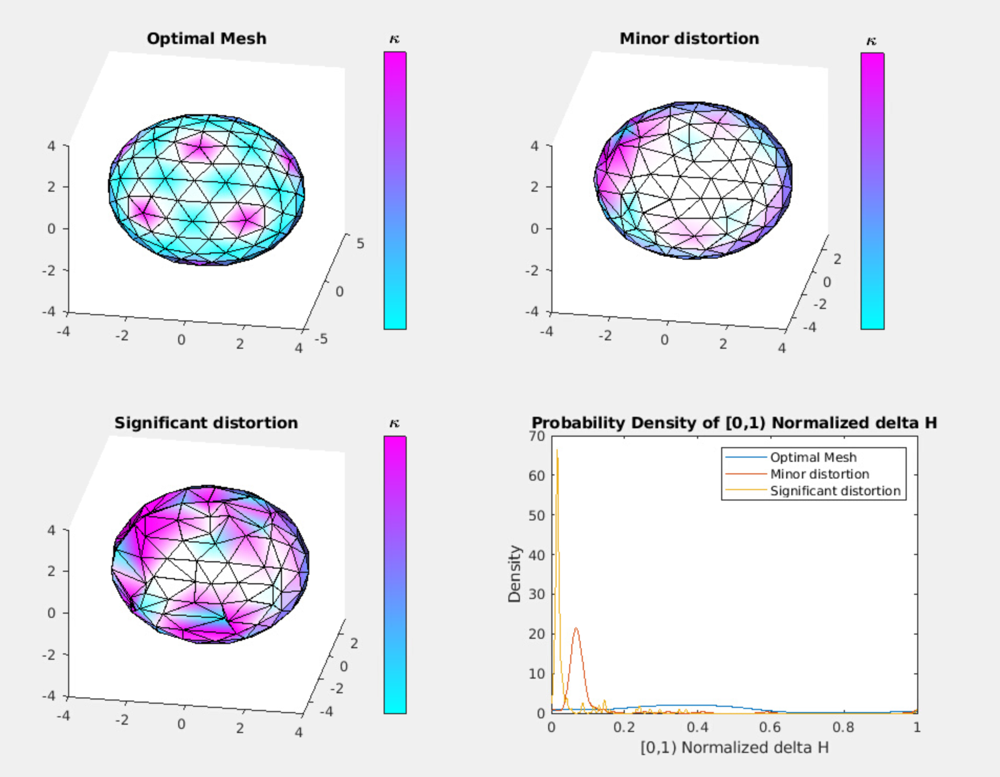
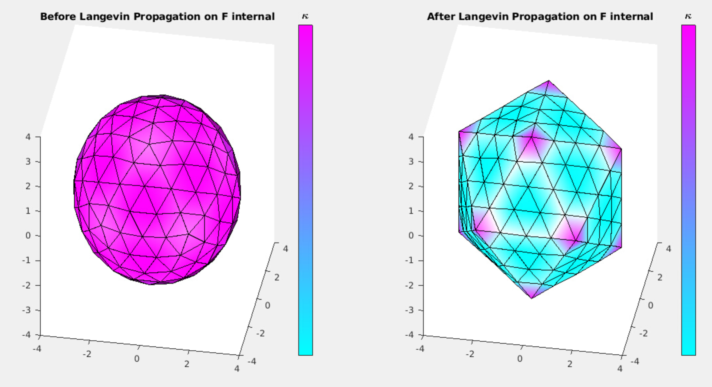
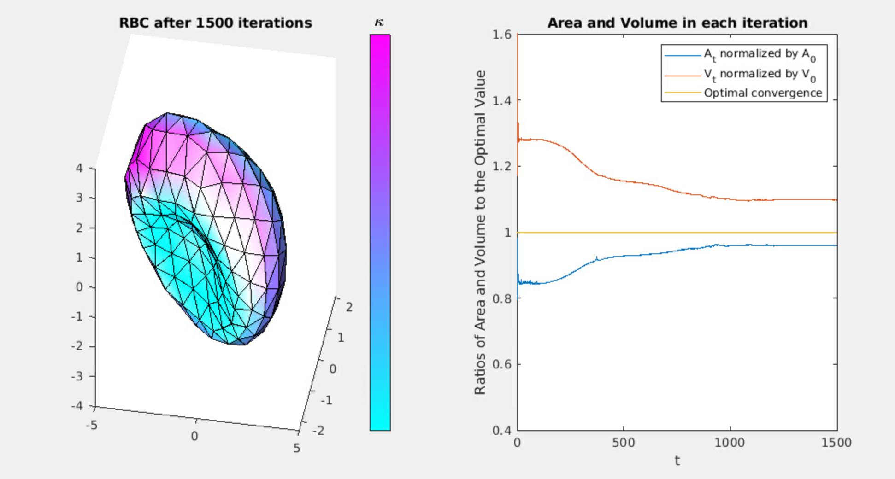
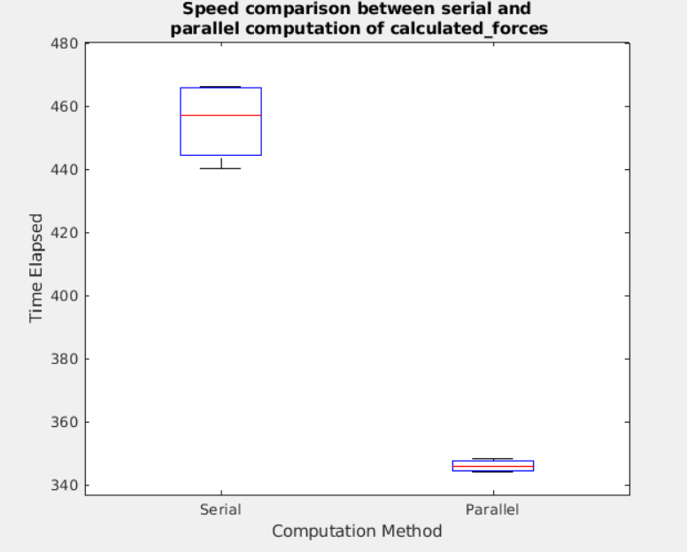
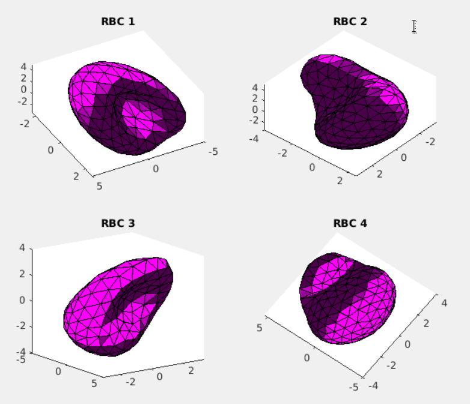

# Module 3 Noah
This is a repository for the module 3 of Software Design Workshop.


## Exercise 1

### Functions

**Generate Figure 1 of the paper. Slide the coordinate of the points along the sphere. **

```matlab 
new_coords = perturbCoords(coord, idxs, percent_to_change)
```

The `perturbCoords` function takes the `m.var.coord`,
the row indexes of these coordinates, and changes these coordinates using the percentage.
The changed values are either nudged in `1+percent_to_change` or `1-percent_to_change` direction.

```matlab
[H_diff, H_diff_new, H_diff_new_clipped] = get_H_diff(m, new_m)
```

The `get_H_diff` function compares the two `ModMembrane` objects and returns the the Helfrich energy
difference per vertex from the ideal energy. `H_diff_new_clipped` is the 50% clipped energy, which is
useful for visualization.

### Result

<figure>

<figcaption> <b> Figure 1. </b> Exercise 1 Results </figcaption>
</figure>


## Exercise 2

**Implement the Langevin Equation and simulate sphere with the internal force.**

### Functions

```matlab
[L, L_edge_all, dir_ij] = compute_L_and_dir_ij(m)
```

`compute_L_and_dir_ij` takes the `ModMembrane` object and calculates the square-form pairwise euclidean
distance for each vertex, and puts them in the `m.var.coord` order, which is the edge-order, and also 
outputs the direction of each vertices in the edge-order.

```matlab
[F_tot, X_int_mtx] = compute_F_tot(m,Fi,dir_ij,L)
```

`compute_F_tot` function computes the cartesian coordinate internal force `F_tot` and X_int in edge-order, `X_int_mtx`.

```matlab
min_dt = calculate_delta_t(m,Fi,F_tot,L,X_int_mtx)
```

The `calculate_delta_t` first calculates the dt per vertex, and returns the minimum of the whole vertex, so we do not overshoot.

### Result

<figure>

<figcaption> <b> Figure 2. </b> Exercise 2 Results </figcaption>
</figure>


## Exercise 3

**Also consider three forces, F_b, F_a, and F_v, in your Langevin equation calculation**

### Functions

```matlab
[F_b, F_a, F_v] = calculate_forces(m, delta_val, k_a, k_v, r, M)
```

This function calculates the bending force, surface tension force,
and pressure force, so they are added on to the total force to be considered in the Langevin calculation.

```matlab
[m,stds,As,Vs, min_dts] = Run_iterations_LE(m, V0, k_c, k_a, k_v, k_r, t, delta_val, save, par)
```

`Run_iterations_LE` runs the Langevin Equation on give `t` iterations, on given parameters. The `par` input variable is the option for
running the `calculate_forces` in parallel or not. If true, the forces will be calculated with the maximum number of workers, and 0
(serial) else. 

### Results

<figure>

<figcaption> <b> Figure 3. </b> Red Blood Cell simulation and convergence plot </figcaption>
</figure>


We see above that the sphere has transformed into a shape of Red Blood Cell(RBC) in 1500 iterations.
To check the convergence, the ratio between the current value and the optimum value for area and volume were plotted.
We can observe in the right panel that the convergence occurs after ~1300 iterations.

## Testing

For unit testing and integration testing, I generated a "ground truth" outputs for `calculate_forces` and `calculate_F_tot`.
These functions should always output the same results when given a same set of cartesian coordinates.
the `./ground_truth/grouth_truth.mat` includes the coordinates and the expected outputs, and the functions
`calculate_forces` and `caculate_F_tot` are tested in `test_calculate_forces` and `testF_tot`. I have created the local variable
for the outputs of the `calculate_forces` and `caculate_F_tot` to local variable within testing scope,
rather than class properties per Andrew's suggestion. `caculate_F_tot` depends on the output from `calculate_L_and_dir_ij`, so in essence,
the `testF_tot` is an integration test.

Regression testing was conducted on the convergence of 1000 iteration of `Run_iterations_LE`, with internal force only.
After the 1000 iterations, the mesh should converge to a dice-like structure with `Area()` and `Volume()` outputs for
the last 10 iterations should be close to the optimal values, `A_0` and `V_0`. The `min_dt` should be very small too.
These tests are done in `testAreaConvergence`, `testVolumeConvergence`, and `testmindtConvergence`.


## Optional Tasks

### Parallelization of calculate_forces

Furthermore, I used the MATLAB profiler to see what function is the bottleneck for the exercise 3 script.
the `calculate_forces` script took over 90% of the computation, so I parallelized the script. Originally, the script had
two nested for loops. The outer one loops over the x,y,z dimensions and the inner one loops over the vertices.
I edited the inner loop so that it can be run in parallel, and compared the time between the serial and parallel computation.

<figure>

<figcaption> <b> Figure 4. </b> Boxplot of Serial and Parallel computation of 4 runs each</figcaption>
</figure>


The parallelization results 23.96% less time taken on average. (ttest p-value: 2.9e-06)

### OOP and parallelizing class objects

`RBC` contains the classdef and methods, and `RBC_parallel` runs 4 parallel computation on 4 meshes.

<figure>

<figcaption> <b> Figure 5. </b> 4 RBC computation with 1500 iterations</figcaption>
</figure>


Some are stuck in a local minima where the shapes are not exactly RBCs since the random seed is different for each workers
, but the parallelization runs without an error.
